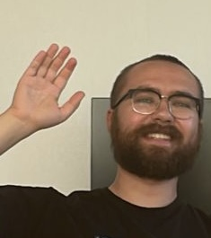

<!--  -->

The CV[^1] for Lucas Hedström[^2].

email: [lucas.hedstrom@protonmail.com](mailto:lucas.hedstrom@protonmail.com)

[Google scholar page](https://scholar.google.com/citations?user=zEhWOwsAAAAJ&hl=sv&oi=ao)

### Current position

PhD student, Umeå University

### Areas of specialization

Biophysics, statistical physics, computational physics, network science

### Appointments held

**from 2019** University teaching at 20% as a part of my PhD education, Umeå University, Umeå

**sum. 2018** CAE Engineer, BAE Systems Hägglunds, Örnsköldsvik

**2016-2017** Part-time teaching assistant, Umeå University, Umeå

**2016-2019** Part-time lab supervisor, Umeå University, Umeå

### Education

**2019-2024** *(Ongoing)* PhD in theoretical biophysics, Umeå University

**2014-2019** MSc in Engineering Physics, Umeå University

### Publications

#### Thesis

**2019** Hedström, L. (2019). Classifying the rotation of bacteria using neural networks.

#### Journal articles

**2024** Hedström, L., Carcedo Martínez, A., & Lizana, L. Identifying stable communities in Hi-C data using a multifractal null model. arXiv preprint [arXiv:2405.05425](https://arxiv.org/abs/2405.05425). Submitted to PLOS Complex Systems.

**2024** Hedström, L., & Olsson, P. Considerations on the relaxation time in shear-driven jamming. arXiv preprint [arXiv:2402.10682](https://arxiv.org/abs/2402.10682). Accepted to Physical Review E.

**2024** Hedström, L., Metzler, R., & Lizana, L. A general mechanism for enhancer-insulator pairing reveals heterogeneous dynamics in long-distant 3D gene regulation. arXiv preprint [arXiv:2402.09209](https://arxiv.org/abs/2402.09209). Submitted to PRX Life.

**2022** Hedström, L., & Lizana, L. Modelling chromosome-wide target search. New Journal of Physics, 25(3), 033024.

#### Book chapters

**2023** Hedström, L., & Lizana, L. Exploring the benefits of DNA-target search with antenna. [arXiv:2311.11727](https://arxiv.org/abs/2311.11727).

### Talks & posters

**2024** Talk at MEEW 2024 in South Korea: "A cool connection between gene regulation and resetting search"

**2023** Talk at the 11th EpiCoN meeting in Umeå: "Epigenetics on Multifractals"

**2022** Poster at the EpiChrom 2022 conference in Uppsala and the 3rd workshop on stochasticity and fluctuations in small systems in South Korea: "Modelling chromosome-wide target search"

**2022** Talk at the MBM 2022 conference in Linköping: "Modelling chromosome-wide target search"

**2020** Talk & poster at the 10th EpiCoN meeting in Umeå; "Zooming in Hi-C maps with Convolutional Neural Networks"

### Supervision

I have been engaged as an academic supervisor in many master's theses. This position entails assisting the student with planning and writing the thesis, and sometimes giving feedback on the project as a whole. A partially complete list of works I've been engaged with can be found [here](https://umu.diva-portal.org/smash/resultList.jsf?dswid=3761&af=%5B%22publicationTypeCode%3AstudentThesis%22%5D&p=1&fs=true&language=en&searchType=SIMPLE&query=lucas+hedstr%C3%B6m&aq=%5B%5B%5D%5D&aq2=%5B%5B%5D%5D&aqe=%5B%5D&noOfRows=50&sortOrder=author_sort_asc&sortOrder2=title_sort_asc&onlyFullText=false&sf=all).

### Courses

**From 2020** co-responsible for the courses "Modeling and Simulations" and "Dynamical Models of Living Systems"

**From 2020** head of planning, supervising and examining practical labs on "Mekanik och energifysik"

**From 2016** head of planning, supervising and examining computer labs on "Foundations in Electromagnetism", "Electrodynamics" and "Advanced Fluid Mechanics"

### Service to the profession

**2022** Planning Committee for the 11th EpiCoN meeting

**2020-2022** Student representative at the research committee at the TekNat faculty.

**2019-2023** Deployment, improvements and management of STRIDE at the physics department, a website where doctoral students can record their achievements during their PhD.

**2019** Development of the most recent version of Röda Tråden, a website with tools allowing master students to plan their course plan for their wanted degree.

### Grants

**2022** Umeå Kommun conference grant for the 11th EpiCoN meeting

**2022** Wallenberg travel grant for South Korean research exchange

### Other

**From 2024** Leader of the bass staff in the choir "Umeå Nationskören"

**From 2023** Bass singer in the choir "Umeå Nationskören"

**2020-2022** Bass singer in the choir "Umeå Vokalensemble"

---

[^1]: CV last updated 03 June 2024

[^2]: "ö" is pronounced kind of like the "e" in the American pronunciation of "fern". Hedstrom is also fine.