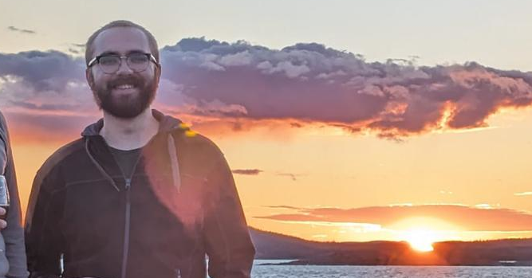

The CV[^1] for Lucas Hedström[^2], PhD.

email: [lucas.hedstrom@protonmail.com](mailto:lucas.hedstrom@protonmail.com)

[Google scholar page](https://scholar.google.com/citations?user=zEhWOwsAAAAJ&hl=sv&oi=ao)

### Current position

Staff Scientist, Umeå University

### Areas of specialization

Biophysics, fluid mechanics, models and simulations, computational physics, statistical physics, network science, machine learning

### Proficiencies

Julia, MATLAB, C, Python, LaTeX, Inkscape, COMSOL, IronCAD, Linux (desktop and server), high-performance computing

### Appointments held

**from 2024** Staff scientist at IceLab, Umeå University, Umeå

*Continuation of my projects as a PhD, including teaching and building the web presence for IceLab.*

**2019-2024** University teaching at 20% as a part of my PhD education, Umeå University, Umeå

*Various teaching duties, both as main- and co-supervisor. A complete list of courses is found below.*

**sum. 2018** CAE Engineer, BAE Systems Hägglunds, Örnsköldsvik

*Performed fluid dynamics simulations to improve the safety and performance of certain components, to later be assessed in an experimental setting.*

**2016-2017** Part-time teaching assistant, Umeå University, Umeå

*Was responsible for the engineering physics websites and other IT-duties, like maintaining the course planning site [Röda Tråden](https://rt.lu.umu.se).*

**2016-2019** Part-time lab supervisor, Umeå University, Umeå

*Co-supervisor on various courses. A complete list is found below.*

### Education

**2019-2024** PhD in theoretical physics, Umeå University

*My PhD focused on better understanding cellular dynamics using simulations and theoretical calculations. This included understanding and cooperating across boundaries between physics and biology, and applying physical concepts on cellular dynamics.*

**2014-2019** MSc in engineering physics, Umeå University

*I specialized in computational physics, where I had a special interest in stochastic simulations, fluid mechanics and programming. My thesis was about applying convolutional neural networks on experimental data of bacteria.*

### Publications

#### Thesis

**2024** *Doctorate thesis* - **Hedström, L.** (2024). *Finding a target on DNA: Interplay between the genomic sequence and 3D structure*

**2019** *Master's thesis* - **Hedström, L.** (2019). *Classifying the rotation of bacteria using neural networks*

#### Journal articles

**2025** Klaminder, J. **Hedström, L.** Jonsson, H. Lee, J. & Lizana, L. *Drying by worming: deciphering the mechanisms in which soil dwelling earthworms makes tundra soil drier*. Under review at Geoderma.

**2024** **Hedström, L.** Yang, S.G. & Lizana, L. (Target search on networks-within-networks with applications to protein-DNA interactions*. arXiv preprint [arXiv:2411.02660](https://arxiv.org/abs/2411.02660)

**2024** **Hedström, L.** Carcedo Martínez, A. & Lizana, L. *Identifying stable communities in Hi-C data using a multifractal null model*. arXiv preprint [arXiv:2405.05425](https://arxiv.org/abs/2405.05425). Under review at PLOS Complex Systems

**2024** **Hedström, L.** & Olsson, P. *Considerations on the relaxation time in shear-driven jamming*. Phys. Rev. E, 109(6), 064906

**2024** **Hedström, L.** Metzler, R. & Lizana, L. *Enhancer-insulator pairing reveals heterogeneous dynamics in long-distant 3D gene regulation*. PRX Life, 2(3), 033008

**2022** **Hedström, L.** & Lizana, L. *Modelling chromosome-wide target search*. New Journal of Physics, 25(3), 033024

#### Book chapters

**2023** **Hedström, L.** & Lizana, L. *Exploring the benefits of DNA-target search with antenna*. [arXiv:2311.11727v2](https://arxiv.org/abs/2311.11727v2)

### Talks, posters and workshops

**2025** Talk at MEEW 2025 in Busan, South Korea: "DNA looping and gene regulation as a stochastic resetting problem"

**2025** Accepted and attended the Winter Workshop on Complex Systems (WWCS) in Mezzoldo, Italy

**2024** Talk at MEEW 2024 in South Korea: "A cool connection between gene regulation and resetting search"

**2023** Talk at the 11th EpiCoN meeting in Umeå: "Epigenetics on Multifractals"

**2022** Poster at the EpiChrom 2022 conference in Uppsala and the 3rd workshop on stochasticity and fluctuations in small systems in South Korea: "Modelling chromosome-wide target search"

**2022** Talk at the MBM 2022 conference in Linköping: "Modelling chromosome-wide target search"

**2020** Talk & poster at the 10th EpiCoN meeting in Umeå; "Zooming in Hi-C maps with Convolutional Neural Networks"

### Supervision

I have been engaged as an academic supervisor in many master's theses. This position entails assisting the student with planning and writing the thesis, and sometimes giving feedback on the project as a whole. A partially complete list of works I've been engaged with can be found [here](https://umu.diva-portal.org/smash/resultList.jsf?dswid=3761&af=%5B%22publicationTypeCode%3AstudentThesis%22%5D&p=1&fs=true&language=en&searchType=SIMPLE&query=lucas+hedstr%C3%B6m&aq=%5B%5B%5D%5D&aq2=%5B%5B%5D%5D&aqe=%5B%5D&noOfRows=50&sortOrder=author_sort_asc&sortOrder2=title_sort_asc&onlyFullText=false&sf=all).

### Courses

**From 2025** Co-responsible for the course "Machine Learning for Physicists"

**From 2020** Co-responsible for the courses "Modelling and Simulation" and "Modelling the Dynamics of Living Systems"

**From 2016** Head of planning, supervising and examining computer labs on "Foundations in Electromagnetism", "Electrodynamics" and "Advanced Fluid Mechanics"

**2020-2024** Head of planning, supervising and examining practical labs on "Mekanik och energifysik"

**2016-2022** Head of planning, supervising and examining computer labs on "Electrodynamics"

### Service to the profession

**2024** Planning for the IceLab stress kickoff workshop - a kickoff for the new excellence center

**2022** Planning Committee for the 11th EpiCoN meeting

**2020-2022** Student representative at the research committee at the TekNat faculty

**2019-2023** Deployment, improvements and management of STRIDE at the physics department, a website where doctoral students can record their achievements during their PhD

**2019** Development of the most recent version of Röda Tråden, a website with tools allowing master students to plan their course plan for their wanted degree

### Grants

**2022** Umeå Kommun conference grant for the 11th EpiCoN meeting

**2022** Wallenberg travel grant for South Korean research exchange

### Other

**2024-current** Bass singer in the choir "Umeå Barockkör"

**2024** Leader of the bass staff in the choir "Umeå Nationskören"

**2023-2024** Bass singer in the choir "Umeå Nationskören"

**2020-2022** Bass singer in the choir "Umeå Vokalensemble"

---

[^1]: CV last updated 15 April 2025.

[^2]: "ö" is pronounced kind of like the "e" in the American pronunciation of "fern". Hedstrom is also fine.